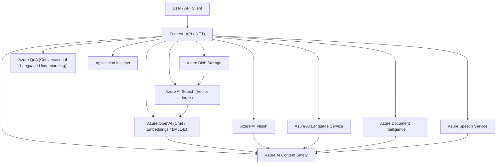
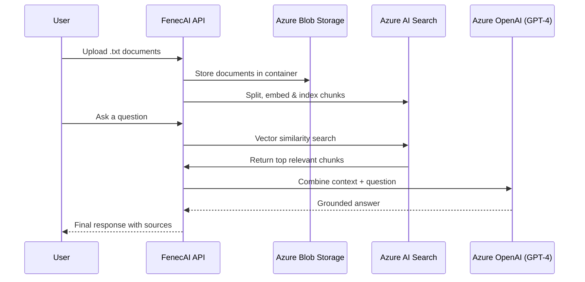

# 🦊 FenecAI — Azure-Powered Generative AI Platform

> _“Merging technology and consciousness to build meaningful AI solutions.”_

FenecAI is a **comprehensive Generative AI API** built with **.NET 8** and **Azure OpenAI**, aligned with the **Microsoft Certified: Azure AI Engineer Associate (AI-102)** objectives.

FenecAI aggregates capabilities such as:

- 🧠 Chat Completions (GPT-4) — Conversational AI with contextual understanding.

- 🧩 RAG (Retrieval-Augmented Generation) — Contextual answers grounded in your documents.

- 🔍 Embeddings & Semantic Similarity — Vector generation and cosine similarity comparison.

- 🎨 Image Generation (DALL·E 3) — Create images from text prompts and store in Azure Blob.

- 🖼️ Image Analysis (Azure AI Vision) — Visual tag extraction, captioning, object detection & OCR.

- 🧾 Document Intelligence (Form Recognizer) — Read, parse, and extract structured data from files (OCR, Invoices, Layout).

- 🗣️ Speech Service (Text ↔ Speech) — Convert text or SSML to speech and transcribe audio to text.

- 🧩 Language Understanding (Azure Language Service) — Detect language, extract key phrases, entities, sentiment, and summaries.

- ❓ QnA (Conversational Language Understanding) — Ask and retrieve answers from a trained knowledge base.

- 🛡️ Content Safety (Text & Image) — Detect unsafe, offensive, or inappropriate content.

- 📊 Token Usage & Cost Metrics — Track token consumption, request latency, and API cost estimation.

- 📁 File Upload & Blob Storage Integration — Upload and manage raw data and generated content.

---

## 🧭 Architecture Overview




Design Principles

- Interface-based services: Each domain logic is abstracted behind an interface.
- Dependency Injection: All services registered via DI.
- Async/await everywhere: For scalability and non-blocking I/O.
- Separation of concerns: Controllers are thin; heavy lifting done in services.
- Clean architecture-ready: Easy to test, mock, extend, maintain.

---
## ☁️ Azure Resources Required
To deploy and run FenecAI successfully, create the following Azure resources:

| **Service**                                                | **Resource Type**                      | **Purpose**                                                                  | **Example Name** |
| ---------------------------------------------------------- | -------------------------------------- | ---------------------------------------------------------------------------- | ---------------- |
| 🧠 **Azure OpenAI**                                        | `Microsoft.CognitiveServices/accounts` | Provides GPT-4, Embeddings, and DALL·E models.                               | `fenecfoundry`   |
| 🔍 **Azure AI Search**                                     | `Microsoft.Search/searchServices`      | Hosts vector index for semantic RAG.                                         | `fenec-search`   |
| 📦 **Azure Storage Account**                               | `Microsoft.Storage/storageAccounts`    | Stores raw documents, images, and ingested data.                             | `fenecstorageai` |
| 🛡️ **Azure AI Content Safety**                            | `Microsoft.CognitiveServices/accounts` | Filters unsafe content for text and images.                                  | `fenec-safety`   |
| 🧠 **Azure AI Vision**                                     | `Microsoft.CognitiveServices/accounts` | Performs image analysis, captioning, object detection, and OCR.              | `fenec-vision`   |
| 🧾 **Azure AI Document Intelligence**                      | `Microsoft.CognitiveServices/accounts` | Extracts text, layout, and structured data (Invoices, Tables, Forms).        | `fenec-docintel` |
| 🧩 **Azure AI Language**                                   | `Microsoft.CognitiveServices/accounts` | Handles language detection, sentiment, entity extraction, and summarization. | `fenec-language` |
| 🗣️ **Azure Speech Service**                               | `Microsoft.CognitiveServices/accounts` | Converts text or SSML to speech and transcribes audio to text.               | `fenec-speech`   |
| ❓ **Azure AI QnA (Conversational Language Understanding)** | `Microsoft.CognitiveServices/accounts` | Enables question-answering with trained knowledge bases.                     | `fenec-qna`      |
| 📈 **Application Insights**                                | `Microsoft.Insights/components`        | Provides telemetry, tracing, and performance monitoring.                     | `fenec-insights` |


---

## 🧩 Required Deployments in Azure OpenAI:

| **Deployment Name**        | **Model**              | **Purpose**                                                                             |
| -------------------------- | ---------------------- | --------------------------------------------------------------------------------------- |
| `gpt-4.1`                  | **GPT-4 Turbo**        | Chat, RAG completions, summarization, reasoning, and natural language generation.       |
| `text-embedding-3-large`   | **Embeddings (Large)** | High-accuracy vector generation for semantic similarity and search indexing.            |
| `text-embedding-3-small`   | **Embeddings (Small)** | Lightweight embedding generation optimized for cost and performance.                    |
| `dall-e-3`                 | **DALL·E 3**           | Image generation from text prompts.                                                     |
| `gpt-4o-mini` *(optional)* | **GPT-4o Mini**        | Lightweight multimodal model for faster responses and lower cost in non-critical tasks. |


---

## ⚙️ Configuration — appsettings.json

Before running the API, configure the following keys:

```bash
{
  "AzureOpenAI": {
    "Endpoint": "https://YOUR-OPENAI-RESOURCE.cognitiveservices.azure.com/",
    "ApiKey": "YOUR_OPENAI_KEY",
    "Deployment": "gpt-4.1",
    "EmbeddingDeployment": "text-embedding-3-large",
    "ImageDeployment": "dall-e-3"
  },
  "AzureStorage": {
    "ConnectionString": "YOUR_STORAGE_CONNECTION_STRING",
    "ContainerName": "data",
    "DalleContainer": "images"
  },
  "AzureAI": {
    "SearchEndpoint": "https://YOUR-SEARCH-RESOURCE.search.windows.net",
    "SearchApiKey": "YOUR_SEARCH_KEY",
    "SearchIndexName": "documents-index",
    "DocumentEndpoint": "https://YOUR-COGNITIVE-RESOURCE.cognitiveservices.azure.com/",
    "DocumentApiKey": "YOUR_COGNITIVE_KEY",
    "LanguageEndpoint": "https://YOUR-COGNITIVE-RESOURCE.cognitiveservices.azure.com/",
    "LanguageApiKey": "YOUR_COGNITIVE_KEY",
    "QnAProjectName": "FenecAI-QnA",
    "QnADeploymentName": "fenecai-qna-prod"
  },
  "AzureContentSafety": {
    "Endpoint": "https://YOUR-SAFETY-RESOURCE.cognitiveservices.azure.com/",
    "ApiKey": "YOUR_SAFETY_KEY"
  },
  "AzureSpeech": {
    "CognitiveEndpoint": "https://YOUR-COGNITIVE-RESOURCE.cognitiveservices.azure.com/",
    "CognitiveKey": "YOUR_SPEECH_KEY"
  },
  "Logging": {
    "LogLevel": {
      "Default": "Information",
      "Microsoft.AspNetCore": "Warning"
    }
  }
}

```

⚠️ Important:
Add appsettings.json to .gitignore so credentials are never pushed to GitHub.

---

## 🧠 Core API Endpoints

| **Module**          | **HTTP Method** | **Endpoint**                      | **Description**                                                    |
| ------------------- | --------------- | --------------------------------- | ------------------------------------------------------------------ |
| 💬 Chat             | POST            | `/api/Chat/complete`              | Generate chat completions using GPT-4.                             |
| 🧩 RAG              | POST            | `/api/RAG/query`                  | Answer questions using document context.                           |
| 🧩 RAG              | POST            | `/api/RAG/ingest`                 | Index documents from Blob Storage for retrieval.                   |
| 🧬 Embeddings       | POST            | `/api/Embeddings/generate`        | Generate embedding vector from text.                               |
| 🧬 Embeddings       | POST            | `/api/Embeddings/similarity`      | Compute cosine similarity between texts.                           |
| 🎨 Image            | POST            | `/api/Image/generate`             | Generate image from text prompt (DALL·E 3).                        |
| 🎨 Image            | POST            | `/api/Image/generate-and-save`    | Generate image and store in Azure Blob Storage.                    |
| 🧠 Image Analysis   | POST            | `/api/ImageAnalysis/analyze`      | Analyze an image and extract visual tags using Azure AI Vision.    |
| 🧠 Image Analysis   | POST            | `/api/ImageAnalysis/caption`      | Generate a caption describing the content of an image.             |
| 🧠 Image Analysis   | POST            | `/api/ImageAnalysis/objects`      | Detect objects within an image using Azure AI Vision.              |
| 🧠 Image Analysis   | POST            | `/api/ImageAnalysis/ocr`          | Extract text from an image using Azure AI Vision OCR.              |
| 🧾 Document OCR     | POST            | `/api/document/read`              | Extract text from documents via Azure Document Intelligence (OCR). |
| 🧾 Document Invoice | POST            | `/api/document/invoice`           | Parse invoice fields using prebuilt Invoice model.                 |
| 🧾 Document Layout  | POST            | `/api/document/layout`            | Extract layout structure (tables, paragraphs, figures).            |
| 🗣️ Speech TTS      | POST            | `/api/speech/text-to-speech-file` | Convert plain text to downloadable audio file.                     |
| 🗣️ Speech SSML     | POST            | `/api/speech/ssml-to-speech`      | Convert SSML (XML) to audio using Azure Speech Service.            |
| 🗣️ Speech STT      | POST            | `/api/speech/speech-to-text`      | Transcribe speech from uploaded audio (Speech → Text).             |
| 🧩 Language         | POST            | `/api/language/detect`            | Detect the dominant language of a text.                            |
| 🧩 Language         | POST            | `/api/language/key-phrases`       | Extract key phrases from a text.                                   |
| 🧩 Language         | POST            | `/api/language/sentiment`         | Analyze sentiment (positive, neutral, negative).                   |
| 🧩 Language         | POST            | `/api/language/entities`          | Extract named entities (people, organizations, locations).         |
| 🧩 Language         | POST            | `/api/language/summarize`         | Generate a summary of long text content.                           |
| 💬 QnA              | POST            | `/api/qna/ask`                    | Ask a question and retrieve answers from knowledge base.           |
| 🛡️ Safety          | POST            | `/api/ContextSafety/analyze`      | Analyze text for unsafe or harmful content.                        |
| 🛡️ Safety          | POST            | `/api/ContextSafety/image`        | Analyze uploaded images for content safety.                        |
| 📊 Metrics          | POST            | `/api/Metrics/tokens`             | Measure token usage, cost, and latency.                            |
| 📁 File             | POST            | `/api/File/upload`                | Upload documents to Azure Blob Storage.                            |


---

## 🔁 RAG (Retrieval-Augmented Generation) Flow


🧠 Workflow / RAG Flow (Query-Time)

- Document ingestion: Upload via /api/rag/ingest → store in Blob → split → embed → index in Search.
- Question: Call /api/rag/query with a prompt.
- Search backend: Use vector search in Cognitive Search → retrieve top chunks.
- OpenAI: Combine chunks + question → call GPT → get grounded answer.
- Return: Answer + relevant source links.
---

## 🚀 Running Locally
Prerequisites

- .NET 8 SDK
- Azure Subscription with required Cognitive Services
- Azure CLI or Portal access
- Visual Studio 2022 / VS Code

---

##  Run Instructions

#### 1️⃣ Restore dependencies
```bash
dotnet restore
```

#### 2️⃣ Build solution
```bash
dotnet build
```

#### 3️⃣ Run API locally
```bash
dotnet run
```

####  Then open:

🔗 https://localhost:7131/swagger/index.html

You’ll see the interactive Swagger UI, complete with summaries, request schemas, and example payloads.


### 📊 Example: RAG Query Flow

1- Upload your .txt documents to the Blob Storage container.

2- Call /api/RAG/ingest — chunks, embeds, and indexes documents.

3- Ask a question via /api/RAG/query, e.g.:

```bash
{
  "question": "What are the core values of FenecAI?"
}
```

### ✅ Returns a semantically grounded answer and the contextual sources used

#### 💎 Quality and Design Highlights

- SOLID-based architecture for maintainability
- Dependency Injection for modularity and testing
- Strict typing (no weak types or any)
- Async-await throughout for non-blocking I/O
- Comprehensive logging for observability
- Responsible AI enforcement via Content Safety

  ---

🛡️ **Recommendations & Best Practices**

- Never commit secrets: use .gitignore and environment variables.
- Enable logging & telemetry: Application Insights integration must be set before production.
- Use interfaces: every service is behind an interface — better testing and modularity.
- Validate inputs strictly: e.g., only allow WAV format in Speech-to-Text.
- Modular architecture: you can ship or disable modules independently (Chat, Document, Speech, QnA).
- Retry & exception handling: use policies (e.g. Polly) for transient failures when calling Azure services.

---
### 🧠  Why FenecAI Matters

FenecAI was designed not just as a project, but as a statement of craftsmanship.
It reflects years of software engineering discipline — merging technical mastery, ethical AI design, and clean architecture into one unified system.

> **“Discipline, clarity, and excellence — every line of code is a reflection of mindset.”**

### 📜 License

This project is released under the MIT License.

## 👤 Author

Alonso Gallegos
Senior Software Engineer | Azure AI Engineer

📍 Costa Rica
💼 GitHub – alonsoegm

> 🌐 “Engineering with purpose, discipline, and conscience.”


