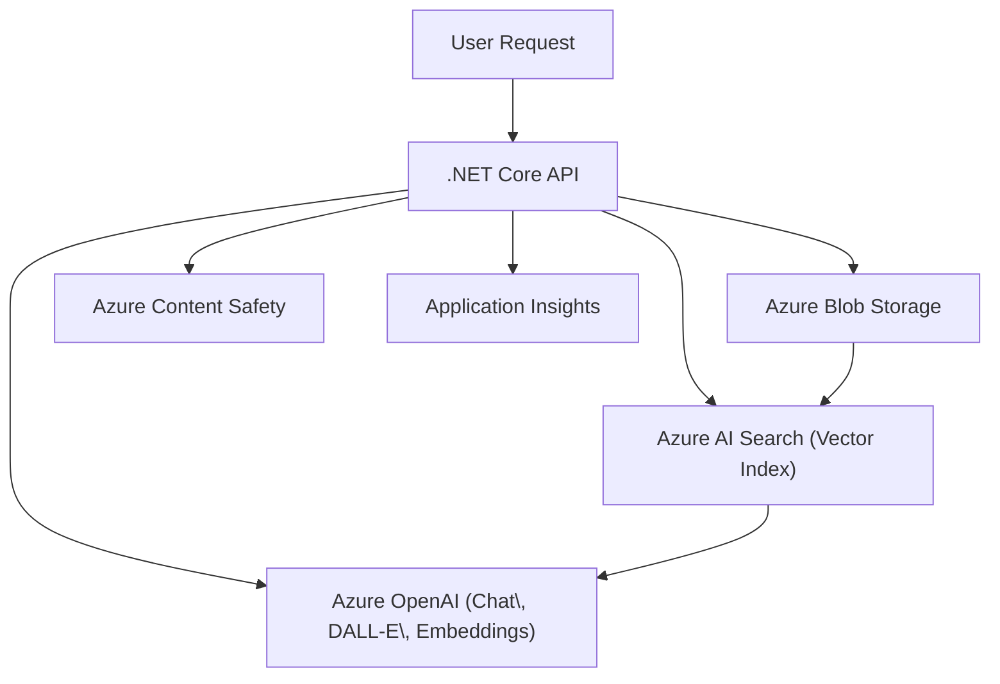
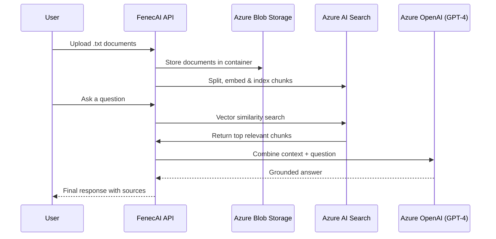

# 🦊 FenecAI — Azure-Powered Generative AI Platform

> _“Merging technology and consciousness to build meaningful AI solutions.”_

FenecAI is a **comprehensive Generative AI API** built with **.NET 8** and **Azure OpenAI**, aligned with the **Microsoft Certified: Azure AI Engineer Associate (AI-102)** objectives.

This project demonstrates expert-level integration of multiple Azure Cognitive Services — including **OpenAI, AI Search, Blob Storage, and Content Safety** — to deliver end-to-end intelligent capabilities such as:

- 🧠 **Chat Completions** (GPT-4)
- 🧩 **RAG (Retrieval-Augmented Generation)**
- 🔍 **Embeddings & Semantic Similarity**
- 🎨 **Image Generation (DALL·E 3)**
- 🛡️ **Content Safety (Text & Image)**
- 📊 **Token Usage & Cost Metrics**

---

## 🧭 Architecture Overview




The system follows a modular service-oriented design:

- Each capability (Chat, Image, RAG, Safety, Metrics) lives in an isolated service.
- All configuration values are injected via Dependency Injection.
- Asynchronous programming ensures scalability and high throughput.

---
## ☁️ Azure Resources Required
To deploy and run FenecAI successfully, create the following Azure resources:

| **Service**                 | **Resource Type**                      | **Purpose**                                   | **Example Name** |
| --------------------------- | -------------------------------------- | --------------------------------------------- | ---------------- |
| 🧠 Azure OpenAI             | `Microsoft.CognitiveServices/accounts` | Provides GPT-4, Embeddings, and DALL·E models | `fenecfoundry`   |
| 🔍 Azure AI Search          | `Microsoft.Search/searchServices`      | Hosts vector index for semantic RAG           | `fenec-search`   |
| 📦 Azure Storage Account    | `Microsoft.Storage/storageAccounts`    | Stores raw documents and generated images     | `fenecstorageai` |
| 🛡️ Azure AI Content Safety | `Microsoft.CognitiveServices/accounts` | Filters unsafe content for text and images    | `fenec-safety`   |
| 📈 Application Insights     | `Microsoft.Insights/components`        | Telemetry and performance monitoring          | `fenec-insights` |

---

## 🧩 Required Deployments in Azure OpenAI:

| **Deployment Name**      | **Model**   | **Purpose**                               |
| ------------------------ | ----------- | ----------------------------------------- |
| `gpt-4.1`                | GPT-4 Turbo | Chat and RAG completions                  |
| `text-embedding-3-large` | Embeddings  | Vector generation for semantic similarity |
| `dall-e-3`               | DALL·E 3    | Image generation                          |

---

## ⚙️ Configuration — appsettings.json

Before running the API, configure the following keys:

```bash
{
  "AzureOpenAI": {
    "Endpoint": "https://YOUR-OPENAI-RESOURCE.cognitiveservices.azure.com/",
    "ApiKey": "YOUR_OPENAI_KEY",
    "Deployment": "gpt-4.1",
    "EmbeddingDeployment": "text-embedding-3-large",
    "ImageDeployment": "dall-e-3"
  },
  "AzureStorage": {
    "ConnectionString": "YOUR_STORAGE_CONNECTION",
    "ContainerName": "data",
    "DalleContainer": "images"
  },
  "AzureAI": {
    "SearchEndpoint": "https://YOUR-SEARCH-RESOURCE.search.windows.net",
    "SearchIndexName": "documents-index",
    "SearchApiKey": "YOUR_SEARCH_KEY"
  },
  "AzureContentSafety": {
    "Endpoint": "https://YOUR-SAFETY-RESOURCE.cognitiveservices.azure.com/",
    "ApiKey": "YOUR_SAFETY_KEY"
  }
}
```

⚠️ Important:
Add appsettings.json to .gitignore so credentials are never pushed to GitHub.

---

## 🧠 Core API Endpoints

| **Module**    | **HTTP Method** | **Endpoint**                   | **Description**                          |
| ------------- | --------------- | ------------------------------ | ---------------------------------------- |
| 🗣️ Chat      | POST            | `/api/Chat/complete`           | Generate chat completions using GPT-4    |
| 🧩 RAG        | POST            | `/api/RAG/query`               | Answer questions using document context  |
| 📥 RAG        | POST            | `/api/RAG/ingest`              | Index documents from Blob Storage        |
| 🧬 Embeddings | POST            | `/api/Embeddings/generate`     | Generate embedding vector from text      |
| 🧬 Embeddings | POST            | `/api/Embeddings/similarity`   | Compute cosine similarity between texts  |
| 🎨 Image      | POST            | `/api/Image/generate`          | Generate image from text prompt          |
| 🎨 Image      | POST            | `/api/Image/generate-and-save` | Generate image and store in Blob Storage |
| 🛡️ Safety    | POST            | `/api/ContextSafety/analyze`   | Analyze text for unsafe content          |
| 🛡️ Safety    | POST            | `/api/ContextSafety/image`     | Analyze uploaded image for safety        |
| 📊 Metrics    | POST            | `/api/Metrics/tokens`          | Measure token usage, cost, and latency   |
| 📤 File       | POST            | `/api/File/upload`             | Upload documents to Blob Storage         |

---

## 🔁 RAG (Retrieval-Augmented Generation) Flow



---

## 🚀 Running Locally
Prerequisites

- .NET 8 SDK
- Azure Subscription with required Cognitive Services
- Azure CLI or Portal access
- Visual Studio 2022 / VS Code

---

##  Run Instructions

#### 1️⃣ Restore dependencies
```bash
dotnet restore
```

#### 2️⃣ Build solution
```bash
dotnet build
```

#### 3️⃣ Run API locally
```bash
dotnet run
```

####  Then open:

🔗 https://localhost:7131/swagger/index.html

You’ll see the interactive Swagger UI, complete with summaries, request schemas, and example payloads.


### 📊 Example: RAG Query Flow

1- Upload your .txt documents to the Blob Storage container.

2- Call /api/RAG/ingest — chunks, embeds, and indexes documents.

3- Ask a question via /api/RAG/query, e.g.:

```bash
{
  "question": "What are the core values of FenecAI?"
}
```

### ✅ Returns a semantically grounded answer and the contextual sources used

#### 💎 Quality and Design Highlights

- SOLID-based architecture for maintainability
- Dependency Injection for modularity and testing
- Strict typing (no weak types or any)
- Async-await throughout for non-blocking I/O
- Comprehensive logging for observability
- Responsible AI enforcement via Content Safety

  ---
### 🧠 Why FenecAI Matters

FenecAI was designed not just as a project, but as a statement of craftsmanship.
It reflects years of software engineering discipline — merging technical mastery, ethical AI design, and clean architecture into one unified system.

> **“Discipline, clarity, and excellence — every line of code is a reflection of mindset.”**

### 📜 License

This project is released under the MIT License.

## 👤 Author

Alonso Gallegos
Senior Software Engineer | Azure AI Engineer

📍 Costa Rica
💼 GitHub – alonsoegm

> 🌐 “Engineering with purpose, discipline, and conscience.”


